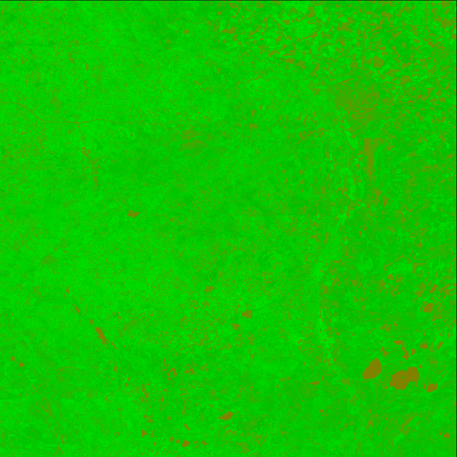
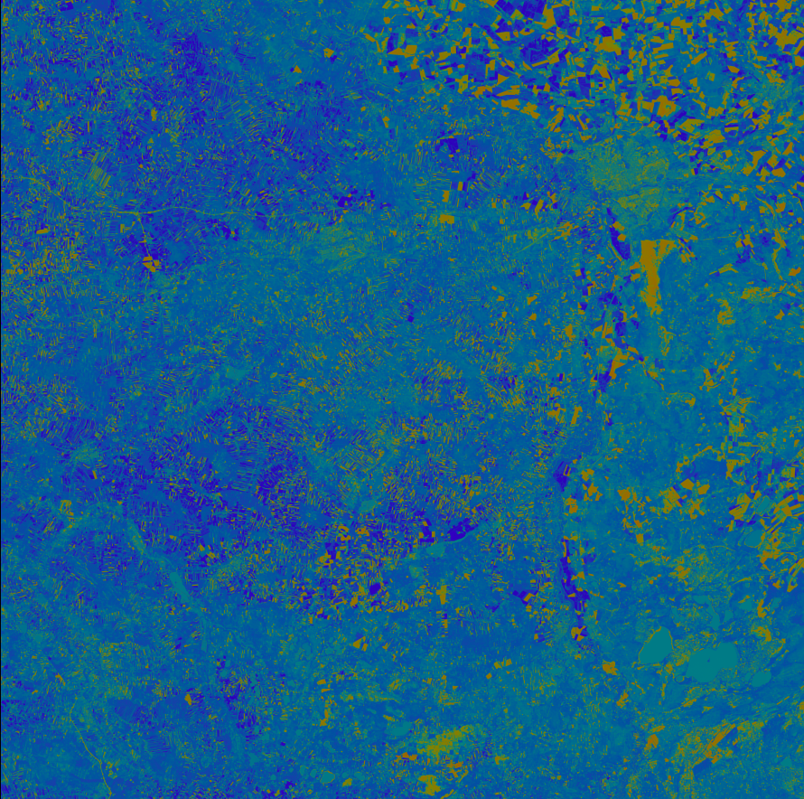

# 🌿 NDVI & NDMI Analyzer

Aplikacja desktopowa stworzona w ramach projektu z przedmiotu programowanie równoległe i rozproszone do analizy zobrazowań satelitarnych Sentinel-2 z wykorzystaniem wskaźników wegetacji (NDVI) i wilgotności (NDMI). Dzięki równoległemu przetwarzaniu danych aplikacja pozwala szybko i interaktywnie ocenić kondycję roślinności na wskazanym obszarze.

## 🚀 Instrukcja Uruchomienia

Uruchomienie aplikacji:

```
mvn javafx:run
```

lub:

- Linux: `./mvnw javafx:run`
- Windows: `mvnw.cmd javafx:run`

## 🛠️ Technologie Wykorzystane

- **Java 17**
- **JavaFX** – GUI
- **GeoTools** – obsługa danych przestrzennych
- **Rasterio (Python)** – konwersja plików `.jp2` → `.tif`
- **Concurrency API (ExecutorService)** – przetwarzanie równoległe
- **Maven** – budowanie i uruchamianie projektu

## 📂 Funkcjonalności

- ✅ Wczytywanie danych satelitarnych z Sentinel-2 (.zip)
- ✅ Obliczanie indeksów **NDVI** i **NDMI**
- ✅ Obsługa dużych obrazów dzięki przetwarzaniu równoległemu
- ✅ Pauzowanie i wznawianie obliczeń
- ✅ Zapis wyników jako obrazów `.png`
- ✅ Interaktywny GUI z informacjami o postępie

## 🔄 Przetwarzanie

1. Wczytanie danych ZIP → konwersja pasm `.jp2` na `.tif` przez skrypt Pythona
2. Skalowanie pasm do wspólnej rozdzielczości
3. Równoległe liczenie NDVI i NDMI:

```
NDVI = (NIR - RED) / (NIR + RED)
NDMI = (NIR - SWIR) / (NIR + SWIR)
```

4. Generowanie obrazów wynikowych

## 🧩 Przykładowy Output

- 🌱 **NDVI** – zdrowa roślinność (zielony), uboga (brązowy)



- 💧 **NDMI** – wilgotne obszary (niebieski), suche (pomarańczowy)



Do zobrazowania przykładowych plików wynikowych wykorzystałem zrzuty ekranu reczywistych plików.
